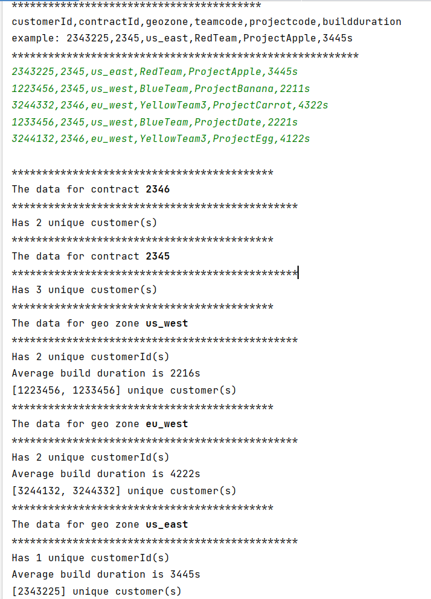

# code challenge

* Click on processData.bat
* Enter data to process
* **Sample data:** 2343225,2345,us_east,RedTeam,ProjectApple,3445s

---------------- **or** ----------------
* Import project into IDE
* Run **ProcessData** class file

**Assumptions**
* Input validation was not handled to the level of data correctness

Screenshot of results for the data given in challenge:

